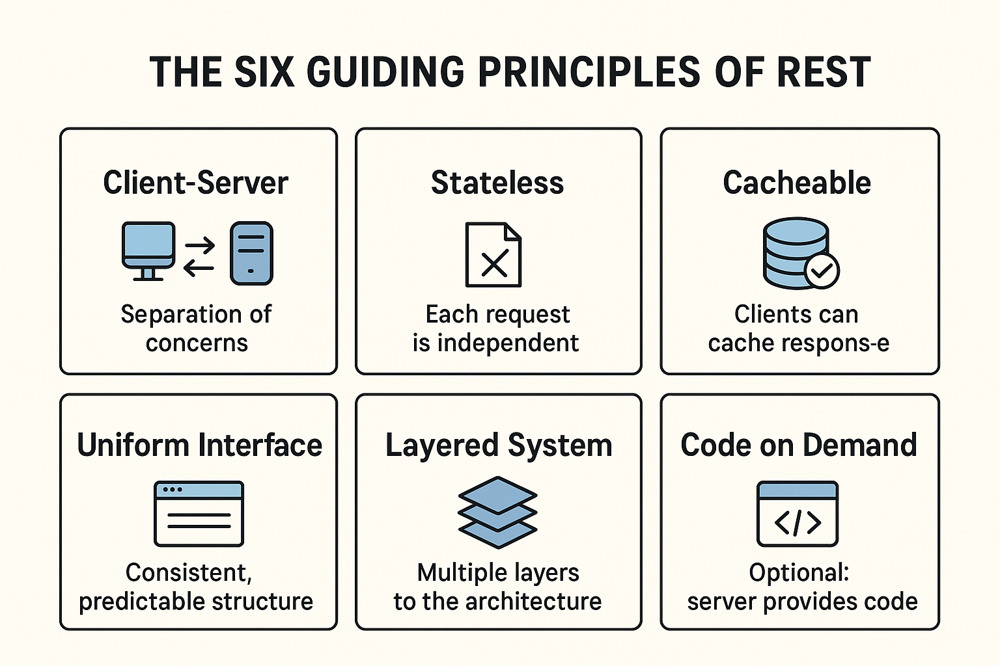

# A. Tài liệu tham khảo
## 1. Thiết kế REST API:
### 1.1. REST API là gì?
- REST là viết tắt của REpresentational State Transfer, kiến trúc cho các hệ thống phân tán. Được ra mắt lần đầu năm 2000 bởi Roy Fielding. Kể từ đó, nó đã trở thành một trong những phương pháp được sử dụng rộng rãi để xây dựng APIs (Application Programing Interfaces). 
- REST không chỉ là một giao thức hay một tiêu chuẩn, mà là một phong cách kiến trúc. Trong giai đoạn phát triển, các nhà phát triển APIs có thể triển khai REST theo nhiều cách khác nhau. 
- Cũng giống như các kiến trúc khác, REST cũng có các nguyên tắc và ràng buộc riêng. Những nguyên tắc này phải đáp ứng nếu một giao diện người dùng được gọi là RESTful API (hoặc REST API).

### 2. Sáu nguyên tắc hướng dẫn của REST:
- Dựa trên một số ràng buộc và nguyên tắc nhằm thúc đẩy tính đơn giản, khả năng mở rộng và tính phi trạng thái trong thiết kế. Sáu nguyên tắc của REST API như sau:

#### 2.1. Client-Server (kiến trúc client-server):
- Ý nghĩa: Tách biệt rõ ràng giữa client (giao diện người dùng, frontend) và server (xử lý logic, lưu trữ dữ liệu).
- Mục đích: Cho phép 2 bên phát triển độc lập. Chient chỉ quan tâm tới giao diện và trải nghiệm, còn server tập trung xử lý và quản lý dữ liệu.
- Ví dụ: Một ứng dụng React (client) gọi API từ backend Golang (server). Frontend có thể thay đổi mà không làm ảnh hưởng tới backend, và ngược lại.

#### 2.2. Stateless (Phi trạng thái):
- Ý nghĩa: Mỗi request từ client đến server phải tự chứa toàn bộ thông tin cần thiết để server hiểu và xử lý.
- Server KHÔNG lưu session của client.
- Mục đích: Đơn giản hóa, tăng khả năng mở rộng (scalability).
- Ví dụ: Client gửi kèm JWWT token trong mỗi request thay vì server lưu session login.

#### 2.3. Cacheable (Có thể cache được):
- Ý nghĩa: Server cần cho phép response được đánh dấu là có thể cache hoặc không thể cache, để client hoặc proxy có thể lưu tạm dữ liệu.
- Mục đích: Tăng hiệu năng, giảm số lần gọi server không cần thiết.
- Ví dụ: API trả về danh sách sản phẩm có thể cache trong 5 phút (cache-Control: max-age=300).

#### 2.4. Uniform interface (Giao diện thống nhất):
- Đây là nguyên tắc CỐT LÕI nhất REST. Một API RESTful có giao diện thống nhất, giúp client-server giao tiếp dễ dàng, dự đoán được.
- Nó gồm có 4 ràng buộc con như sau:
	- Resource identification (Xác định tài nguyên):
		- Mỗi tài nguyên (réource) được xác định duy nhất bằng URL.
		- Ví dụ: /user/123 đại diện cho user có id=123.
	- Resource manipulation through representations (Thao tác qua representation):
		- Client thao tác với resource thông qua representation (JSON, XML,...).
		- Ví dụ: Gửi JSON { "name": "Nam" } để update user.
	- Selt-descriptive messages (Thông điệp tự mô tả):
		- Request và response phải có đủ metadata để mô tả cách xử lý.
		- Ví dụ: Header Content-application/json cho biết payload là JSON.
	- HATEOAS (Hypermedia As The Engine Of Application State):
		- Response nên chứa link để điều hướng tiếp theo.
		- Ví dụ: khi trả về user, API cũng trả về link để xem danh sách các bài viết của user.
#### 2.5. Layered System (Hệ thống phân lớp):
- Ý nghĩa: Kiến trúc được thiết kế theo nhiều lớp, client không cần biết mình đang giao tiếp với server gốc hay qua procxy, load balencer, cache...
- Mục đích: Tăng tính bảo mật, khả năng mở rộng, linh hoạt triển khai.
- Ví dụ: Một request từ chient đi qua API Gateway -> load balancer -> Microservice -> Database.

#### 2.6. Code on Demand (Tải code theo yêu cầu) - Optional:
- ý nghĩa: Server có thể gửi code thực thi (ví dụ javascript) cho client, giúp mở rộng chức năng mà không cần cài đặt toàn bộ.
- Mục đích: Tăng tính linh hoạt, giảm ràng buộc giữa client và server.
- Ví dụ: Một API trả về script JS để client chạy trực tiếp trình duyệt.
- Lưu ý: Đây là nguyên tắc TÙY CHỌN, không bắt buộc để được xem là RESTful.

#### Tóm tắt: 
1. Client-Server -> tách biệt giao diện và xử lý.
2. Stateless -> mỗi request độc lập, không lưu session.
3. Cacheable -> tận dụng cache để tăng hiệu năng.
4. Uniform interface -> giao diện thống nhất, dự đoán được.
5. Layered System -> phân lớp, mở rộng dễ dàng.
6. Code on Demand -> server có thể cung cấp code cho client (tùy chọn).

## 2. Tài liệu tham khảo:
- https://restfulapi.net/api-pagination-sorting-filtering

# B. Tài liệu chi tiết các tính năng API

## Tổng quan hệ thống
USP Management Device API là một REST API quản lý thiết bị USP (User Services Platform) với các resource chính:
- **Profiles**: Quản lý cấu hình profile cho thiết bị
- **Parameters**: Quản lý các tham số cấu hình
- **Models**: Quản lý model thiết bị
- **Groups**: Quản lý nhóm thiết bị  
- **Firmwares**: Quản lý phần mềm firmware
- **Devices**: Quản lý thiết bị cụ thể

---

## I. CRUD cho Profiles

### 1. Tạo Profile (Create Profile)

**Endpoint**: `POST /profiles`

#### 1.1. Mô tả chức năng:
- Tạo mới một profile với danh sách parameters tương ứng
- Profile là cấu hình định nghĩa cách thức giao tiếp và các tham số cho thiết bị USP

#### 1.2. Request Body:
```json
{
	"name": "device_management_profile",
	"msg_type": 1,
	"tags": ["public", "management"],
	"max_depth": 5,
	"allow_partial": true,
	"first_level_only": false,
	"return_commands": true,
	"return_events": true,
	"return_params": true,
	"return_unique_key_sets": false,
	"send_resp": true,
	"description": "Profile for device management operations",
	"parameters_ids": [
		{
			"parameter_id": "61be48af-b2ee-49df-848c-dae94f385570"
		}
	]
}
```

#### 1.3. Validation Rules:
- `name`: Bắt buộc, tối đa 255 ký tự, không trùng lặp
- `msg_type`: Bắt buộc, giá trị từ 1-23
- `tags`: Bắt buộc, tối đa 2 tags
- `max_depth`: Bắt buộc, giá trị 0-100
- `parameters_ids`: Bắt buộc, ít nhất 1 parameter

#### 1.4. Response:
- **Success (201)**: Profile được tạo thành công
- **Bad Request (400)**: Validation lỗi hoặc profile name đã tồn tại
- **Internal Server Error (500)**: Lỗi server

#### 1.5. Business Logic:
- Kiểm tra tên profile không trùng lặp
- Kiểm tra parameter_id có tồn tại trong hệ thống
- Tự động set status = "ENABLE" khi tạo mới
- Lấy user từ header để ghi nhận người tạo
- Tạo quan hệ profile-parameter trong bảng ProfileParameter

---

### 2. Cập nhật Profile (Update Profile)

**Endpoint**: `PUT /profiles/{profile_id}`

#### 2.1. Mô tả:
- Cập nhật thông tin profile và danh sách parameters

#### 2.2. Request Body:
```json
{
	"name": "updated_profile_name",
	"msg_type": 2,
	"tags": ["private"],
	"max_depth": 10,
	"status": "DISABLE",
	"description": "Updated description",
	"parameters": [
		{
			"id": "new-parameter-id"
		}
	]
}
```

#### 2.3. Business Logic:
- Kiểm tra profile tồn tại
- Validate dữ liệu đầu vào
- Cập nhật thông tin profile
- Xóa các quan hệ parameter cũ và tạo mới

---

### 3. Xóa Profile (Delete Profile)

**Endpoint**: `DELETE /profiles/{profile_id}`

#### 3.1. Mô tả:
- Xóa mềm profile (soft delete) bằng cách set status = "DELETED"

#### 3.2. Business Logic:
- Kiểm tra profile tồn tại và chưa bị xóa
- Set status = "DELETED" 
- Không xóa vật lý khỏi database

---

### 4. Lấy danh sách Profiles (List Profiles)

**Endpoint**: `GET /profiles`

#### 4.1. Query Parameters:
- `page`: Số trang (default: 1)
- `limit`: Số lượng item per page (default: 10)
- `status`: Lọc theo trạng thái (ENABLE/DISABLE)
- `search`: Tìm kiếm theo tên profile
- `sort_by`: Sắp xếp theo field (name, created_at, updated_at)
- `sort_order`: Thứ tự sắp xếp (asc, desc)

#### 4.2. Response:
```json
{
	"data": [
		{
			"id": "uuid",
			"name": "profile_name",
			"msg_type": 1,
			"status": "ENABLE",
			"created_at": "2023-10-09T10:00:00Z",
			"profile_parameters": [...]
		}
	],
	"pagination": {
		"page": 1,
		"limit": 10,
		"total": 100,
		"total_pages": 10
	}
}
```

---

### 5. Đếm Profiles theo trạng thái

**Endpoint**: `GET /profiles/count`

#### 5.1. Response:
```json
{
	"data": {
		"enabled": 25,
		"disabled": 5,
		"total": 30
	}
}
```

---

### 6. Import/Export CSV

**Import Endpoint**: `POST /profiles/import-csv`
**Export Endpoint**: `GET /profiles/export-csv`

#### 6.1. Import CSV:
- Upload file CSV chứa danh sách profiles
- Validate từng dòng dữ liệu
- Batch insert vào database

#### 6.2. Export CSV:
- Export toàn bộ profiles ra file CSV
- Có thể filter theo các điều kiện

---

## II. CRUD cho Parameters

### 1. Tạo Parameter (Create Parameter)

**Endpoint**: `POST /parameters`

#### 1.1. Request Body:
```json
{
	"name": "Device.DeviceInfo.ModelName",
	"data_type": "string",
	"access_rights": "R",
	"default_value": "",
	"description": "Model name of the device",
	"path": "Device.DeviceInfo.",
	"is_required": true
}
```

#### 1.2. Validation:
- `name`: Bắt buộc, unique
- `data_type`: string, int, boolean, datetime
- `access_rights`: R (Read), W (Write), RW (Read-Write)

---

### 2. Cập nhật Parameter

**Endpoint**: `PUT /parameters/{parameter_id}`

---

### 3. Xóa Parameter

**Endpoint**: `DELETE /parameters/{parameter_id}`

---

### 4. Danh sách Parameters

**Endpoint**: `GET /parameters`

#### 4.1. Query Parameters:
- Hỗ trợ tương tự như profiles
- Thêm filter theo `data_type`, `access_rights`

---

### 5. Parameters Combobox

**Endpoint**: `GET /parameters/combobox`

#### 5.1. Mô tả:
- Trả về danh sách parameters dạng key-value cho dropdown/combobox

---

### 6. Import/Export Parameters

**Import**: `POST /parameters/import-csv`
**Export**: `GET /parameters/export-csv`

---

## III. CRUD cho Models

### 1. Tạo Model

**Endpoint**: `POST /models`

#### 1.1. Request Body:
```json
{
	"name": "Router-AC1200",
	"manufacturer": "TP-Link",
	"product_class": "IGD",
	"oui": "00259C",
	"model_name": "Archer-C50",
	"description": "AC1200 Wireless Router"
}
```

---

### 2. Cập nhật Model

**Endpoint**: `PUT /models/{model_id}`

---

### 3. Xóa Model

**Endpoint**: `DELETE /models/{model_id}`

---

### 4. Lấy thông tin Model

**Endpoint**: `GET /models/{model_id}`

---

### 5. Danh sách Models

**Endpoint**: `GET /models`

---

## IV. CRUD cho Groups (Nhóm thiết bị)

### 1. Tạo Group

**Endpoint**: `POST /models/{model_id}/groups`

#### 1.1. Request Body:
```json
{
	"name": "Office Routers",
	"description": "Routers used in office environment",
	"location": "Building A, Floor 2"
}
```

---

### 2. Cập nhật Group

**Endpoint**: `PUT /models/{model_id}/groups/{group_id}`

---

### 3. Xóa Group

**Endpoint**: `DELETE /models/{model_id}/groups/{group_id}`

---

### 4. Lấy thông tin Group

**Endpoint**: `GET /models/{model_id}/groups/{group_id}`

---

### 5. Danh sách Groups

**Endpoint**: `GET /models/{model_id}/groups`

---

## V. CRUD cho Firmwares

### 1. Tạo Firmware

**Endpoint**: `POST /models/{model_id}/firmwares`

#### 1.1. Request Body:
```json
{
	"version": "2.0.1",
	"release_date": "2023-10-01",
	"file_url": "https://firmware.example.com/v2.0.1.bin",
	"file_size": 25165824,
	"checksum": "sha256:abc123...",
	"description": "Bug fixes and security updates"
}
```

---

### 2. Cập nhật Firmware

**Endpoint**: `PUT /models/{model_id}/firmwares/{firmware_id}`

---

### 3. Xóa Firmware

**Endpoint**: `DELETE /models/{model_id}/firmwares/{firmware_id}`

---

### 4. Lấy thông tin Firmware

**Endpoint**: `GET /models/{model_id}/firmwares/{firmware_id}`

---

### 5. Danh sách Firmwares

**Endpoint**: `GET /models/{model_id}/firmwares`

---

## VI. CRUD cho Devices

### 1. Tạo Device

**Endpoint**: `POST /models/{model_id}/groups/{group_id}/devices`

#### 1.1. Request Body:
```json
{
	"serial_number": "ABC123456789",
	"mac_address": "00:25:9C:12:34:56",
	"ip_address": "192.168.1.100",
	"device_name": "Office Router 01",
	"location": "Reception Desk",
	"firmware_version": "2.0.1"
}
```

---

### 2. Cập nhật Device

**Endpoint**: `PUT /models/{model_id}/devices/{device_id}`

---

### 3. Xóa Device

**Endpoint**: `DELETE /models/{model_id}/devices/{device_id}`

---

### 4. Lấy thông tin Device

**Endpoint**: `GET /models/{model_id}/devices/{device_id}`

---

### 5. Danh sách Devices

**Endpoint**: `GET /models/{model_id}/devices`

---

### 6. Import Devices

**Endpoint**: `POST /models/{model_id}/groups/{group_id}/devices/import-csv`

---

## VII. Tính năng thống kê (Count APIs)

### 1. Đếm theo trạng thái:
- `GET /profiles/count`
- `GET /parameters/count`
- `GET /models/{model_id}/groups/count`
- `GET /models/{model_id}/firmwares/count`
- `GET /models/{model_id}/devices/count`
- `GET /models/count`

### 2. Đếm thiết bị theo group:
- `GET /models/{model_id}/groups/{group_id}/devices/count`

---

## VIII. Kiến trúc hệ thống

### 1. Cấu trúc thư mục:
```
app/
├── controller/http/          # HTTP Controllers & Routes
├── business/management_uc/   # Business Logic & Use Cases  
├── business/models/          # Data Models
├── infras/                   # Infrastructure & Database
├── common/                   # Common utilities
└── middlewares/              # Middleware components
```

### 2. Nguyên tắc thiết kế:
- **Clean Architecture**: Tách biệt Controller, Business Logic, Infrastructure
- **Validation**: Validate dữ liệu ở Controller layer
- **Error Handling**: Centralized error handling
- **Transaction**: Sử dụng database transaction cho data consistency
- **Soft Delete**: Không xóa vật lý, chỉ đánh dấu status
- **Audit Trail**: Ghi nhận user và timestamp cho mọi thay đổi

### 3. Response Format:
#### Success Response:
```json
{
	"data": { /* actual data */ },
	"pagination": { /* pagination info */ },
	"message": "Success"
}
```

#### Error Response:
```json
{
	"error": {
		"code": "VALIDATION_ERROR",
		"message": "Invalid input data",
		"details": [
			{
				"field": "name",
				"message": "Name is required"
			}
		]
	}
}
```

---

## IX. Lưu ý kỹ thuật

### 1. Database:
- Sử dụng PostgreSQL với UUID làm primary key
- Implement soft delete với status field
- Index trên các field thường xuyên query (name, status)

### 2. Performance:
- Pagination cho tất cả list APIs
- Lazy loading cho relationships
- Database connection pooling

### 3. Security:
- Input validation và sanitization
- SQL injection protection
- Rate limiting
- Authentication & Authorization headers

### 4. Monitoring:
- Structured logging với levels
- Request/Response logging
- Performance metrics
- Error tracking
